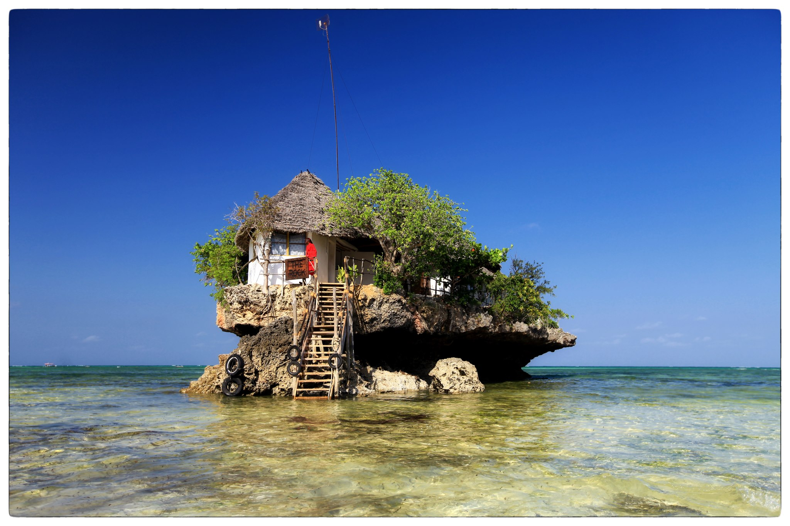

Why I am excited about DjangoCon Africa
#######################################

:date: 2023-10-04 22:20
:modified: 2023-10-04 22:20
:tags: djangoconafrica, community
:category: community
:slug: djangocon-africa
:authors: Humphrey
:status: published

As a Django developer and community organizer in Africa, I am beyond excited that the first-ever DjangoCon in Africa is coming to Zanzibar, Tanzania, from November 6th to 11th. This news has made me feel emotional, being an opportunity to reconnect with the best of my own community.

Firstly, hosting DjangoCon in Zanzibar brings it closer to home for developers in Africa, particularly those in Eastern and Southern Africa. 
This means we won't have to travel far to gain valuable insights, share our experiences and best practices,
and network with the brightest minds in the industry. 

Moreover, DjangoCon is not just any other tech conference; it is an event that is centered around a `collaboration driven ethos <https://www.themindfulword.org/2013/art-community-building-new-age-participation/>`_ of open-source culture. 
The event is geared towards fostering collaboration and inclusivity, plus involving as many people as possible in this programming ecosystem. 

DjangoCon is an opportunity for community-building and advancing the knowledge and skills of developers.
Attending this conference feels like being part of something more significant than just acquiring technical knowledge.
It is about sharing our experiences and engaging with the Django community.

As a developer in Africa, the prospect of meeting people from different cultures and perspectives excites me. 
This kind of networking provides an opportunity to learn and grow as a person and a developer. 

Furthermore, I look forward to mentoring at `Django Girls Zanzibar <https://djangogirls.org/zanzibar>`_, the hands-on training workshop on programming and web development with Django Girls.
This is an excellent opportunity for women who are looking to get into programming. It will provide a collaborative 
learning environment and mentorship while making new friends.

Personally, I've missed PyCon Africa and attending conferences since 2018 due to Covid restrictions, and I am eager to attend DjangoCon in Africa.
The conference will bring together experienced Django developers from Africa and beyond. 
As a job seeker, I hope to engage and explore the best opportunities with other developers who are willing to mentor and offer advice.

As a community organizer I am also excited by the commitment of the organizers to provide a safe and welcoming environment for everyone as enshrined in the `DjangoCon Africa Code of Conduct <https://2023.djangocon.africa/conduct/>`_. This is an important aspect that transcends every other aspect of the conference. I want to feel at ease and comfortable in the environment, knowing that I can focus on the event's purpose and take away a lot without any distractions. This inclusivity policy also means that people of all backgrounds, ethnicities, and genders will be able to participate fully without prejudice or discrimination.

Lastly, having DjangoCon in Zanzibar, and an Island known for its sandy beaches, is the icing on the cake.
Socializing and having fun are part of the equation, and it makes the experience that much more fulfilling. 
Having attended a Django Con before and experiencing the community's warmth and vibrancy, there is no doubt that DjangoCon Africa will be a great success.

In conclusion, DjangoCon in Africa is an exciting event that has been a long time coming. The dream of hosting the event in Africa has finally come true,
and we can't wait for the world to explore and experience the vibrant developer community it has to offer. Let's keep the conversation going and see you at DjangoCon Africa.
